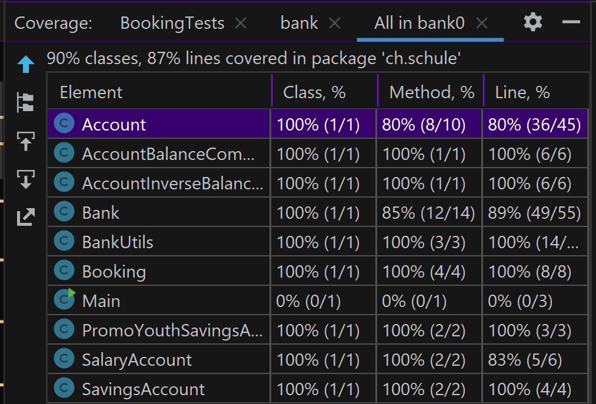

# Aufgabe3: Funktionsweise Banken Simulation
## Bank
- Objekt: Bank
- Man kann einen Account erstellen
- Man kann Informationen aus dem Account holen
- Man kann auf den Account zugreifen 
- Man kann Informationen printen

## Account
- Objekt: Account
- Hat eine id, um mit der Bank in Verbindung gebracht zu werden
- Hat eine Variable für den Kontostand
- Verbindung mit verschiedenen Arten von Accounts

## Booking 
- Objekt: Booking
- Hat ein Datum und einen Betrag
- Wird verwendet, um den Kontostand zu verändern

## BankUtils
- Werden verwendet um zu bestimmen, ob eine Änderung des Kontostandes rechtens ist (von den Datenwerten her)

## To run the code in cmd
./mvnw spring-boot:run -e

## Coding Exercise -> Code Coverage
To see the code coverage:
- right click on ch.schule.bank.junit5
- run tests in that package 
- at the top of the page at Run decide run all in Bank with Coverage
- open the correct folder

