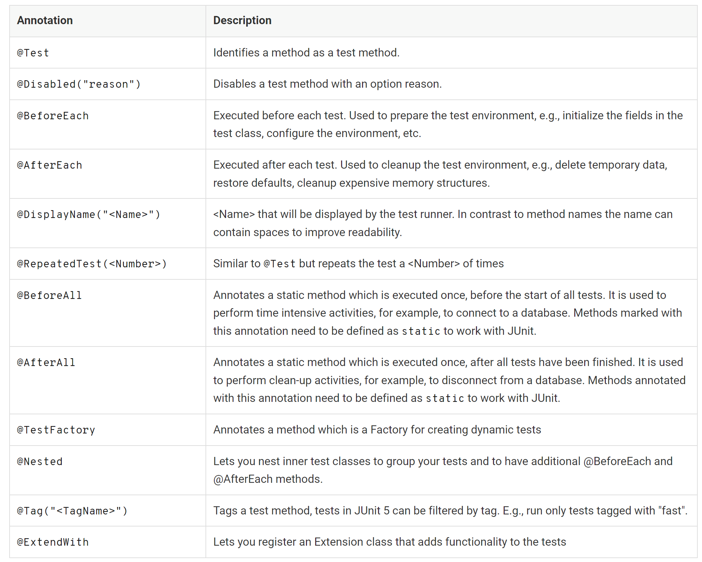

# Unit Test Research
## Test Levels
- Unit/Component Testing (kurze Ausführzeit, wird am Anfang der Entwicklungsfrage definiert)
- Integration Testing
- System Testing
- Acceptance Testing 

## White Box vs Black Box Testing
- White Box: Einblick in den Quellcode ist gestattet d.h. es wird am Code geprüft
- Black Box: Tests werden anhand von Spezifikationen oder Anforderungen entwickelt. Tests werden also ohne kenntnis über die Implementierung getestet

## Unit Testing
- Gehören zum ersten Level von Testing
- Wird von den Entwicklern geschrieben und ausgeführt (später automatisiert beim build)
- White-Box-Test
- Komponenten werden einzeln in Isolation getestet (in Java Klassen oder Methoden)
- Fehler werden früh entdeckt
- Gibt den Entwickler die Sicherheit für Code Refactorings
- Hauptsächlich funktionale Anforderungen werden hier getestet
- Limitation: Nur weil Komponenten in Isolation korrekt funktionieren, heisst es nicht, dass Komponenten zwischen
einander korrekt funktionieren

## Weitere Testing Arten
https://gitlab.com/ch-tbz-it/Stud/m450/m450/-/blob/main/Unterlagen/test-levels/README.md 

## Rolle von Unit-Tests
- Design der Software zu steuern (weniger um Defekte zu finden)
- Um langfristig änderbaren Code zu haben/behalten
- Wichtig für Refactorings
- Versehentliche Änderungen werden sofort entdeckt

## Was zeichnet gute Unit-Tests aus
- Sind isoliert (sie hängen nicht voneinander ab)
- Testen jeweils genau eine Eigenschaft
- Sind vollständig automatisiert
- sind schnell ausführbar
- Wiederholbar und liefern immer das gleiche Ergebnis
- leicht verständlich und kurz
- Hohe Codequalität (Code Conventions etc.)
- Testen relevanten Code (z.B. keine Tests für Getter/Setter)
- Werden idealerweise vor dem zu testenden Code geschrieben (Test Driven Development)

## JUnit
- Testing Framework für Java
- Verwendet für Test-Driven Development
